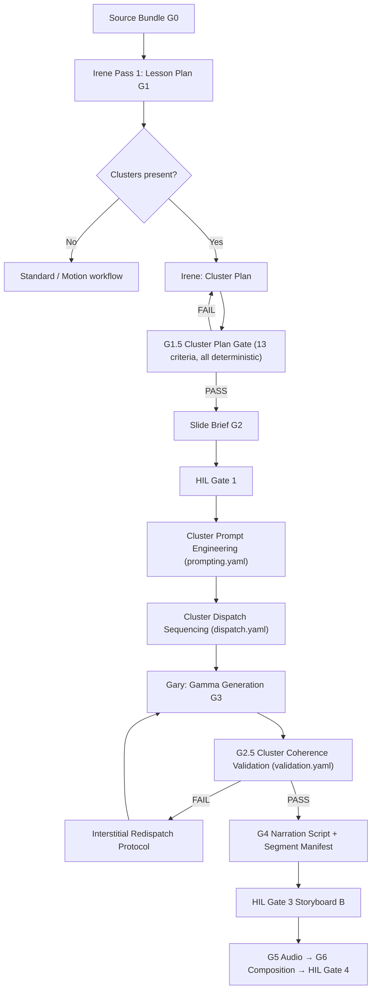

# Cluster Workflow Lifecycle

**Status:** Wave 1 complete (stories 20b-3, 22-1, 21-5) | **Gate:** G1.5 Cluster Plan | **Prompt Pack:** v4.3

This document describes the cluster + interstitial narrated workflow variant. It supplements the standard and motion workflows documented in `docs/structural-walk.md` and complements the operator-facing `production-prompt-pack-v4.3-narrated-lesson-with-video-or-animation.md`.

---

## Pipeline Diagram

---

## Key Components

| Component | Location | Purpose |
|-----------|----------|---------|
| G1.5 contract | `state/config/fidelity-contracts/g1.5-cluster-plan.yaml` | 13 deterministic criteria for cluster plan validation |
| Prompt engineering | `skills/bmad-agent-marcus/scripts/cluster_prompt_engineering.py` | Renders cluster-aware prompts from `state/config/prompting.yaml` |
| Dispatch sequencing | `skills/bmad-agent-marcus/scripts/cluster_dispatch_sequencing.py` | Builds ordered batch plan from `state/config/dispatch.yaml` |
| Coherence validation | `skills/bmad-agent-marcus/scripts/cluster_coherence_validation.py` | Validates output against `state/config/validation.yaml` rules |
| Template library | `skills/bmad-agent-marcus/scripts/cluster_template_library.py` | Loads and validates structural cluster templates from `cluster-templates.yaml` |
| Template planner | `skills/bmad-agent-marcus/scripts/cluster_template_planner.py` | Selects template per cluster using source density + operator overrides |
| Template selector | `skills/bmad-agent-marcus/scripts/cluster_template_selector.py` | Scoring engine for template–content alignment |
| Redispatch protocol | `skills/bmad-agent-marcus/scripts/interstitial_redispatch_protocol.py` | Re-dispatches failed interstitials on coherence failure |
| Redispatch CLI | `skills/bmad-agent-marcus/scripts/run-interstitial-redispatch.py` | Operator-facing CLI for manual credit-gated redispatch |
| Template evaluator | `skills/bmad-agent-marcus/scripts/evaluate_cluster_template_selection.py` | Post-run scoring of template–content alignment quality |
| Cluster plan validator | `skills/bmad-agent-marcus/scripts/validate-cluster-plan.py` | Pre-gate cluster plan structural validation |
| G1.5 gate runner | `skills/bmad-agent-marcus/scripts/run-g1.5-cluster-gate.py` | Executes G1.5 contract checks and emits pass/fail receipt |

---

## Config Files

All cluster configs live in `state/config/` (see `docs/directory-responsibilities.md`):

| File | Contents |
|------|----------|
| `prompting.yaml` | Templates (small/large), safety clauses (no PII, blocked terms), token budget (max 400/prompt), hashing |
| `dispatch.yaml` | Policy: `priority_size_id` ordering, `batch_size: 2`, `max_concurrency: 4`, retries (max 2, retryable: 429/500), backoff |
| `validation.yaml` | Hashing, rules: required/forbidden terms, sequencing enforcement, sampling mode: full |
| `narration-script-parameters.yaml` | Cluster narration word ranges — head: [80, 140], interstitial: [25, 40] |

---

## Gate Criteria Summary

### G1.5 Cluster Plan (13 criteria)

All criteria are `evaluation_type: deterministic`. Key checks:

- **G1.5-01** Cluster structure integrity — every interstitial has a valid parent head
- **G1.5-02** `interstitial_type` vocabulary — canonical five-type set
- **G1.5-03–13** Isolation target specificity, narrative arc presence, develop_type assignment/non-redundancy, double_dispatch_eligible, cluster_interstitial_count bounds, density target, cluster_position completeness, master_behavioral_intent

Full contract: `state/config/fidelity-contracts/g1.5-cluster-plan.yaml`

### G2.5 Cluster Coherence (deterministic)

Post-Gamma validation of intra-cluster consistency. Applied after Gary dispatch, before G4 narration.

- Validates output against `state/config/validation.yaml` rules (required/forbidden terms, sequencing, hashing)
- Coherence failure triggers interstitial redispatch protocol (max 2 retries)

Full contract: `state/config/fidelity-contracts/g2.5-cluster-coherence.yaml`

### G4 Cluster Criteria

**Live in YAML (g4-narration-script.yaml):**
- **G4-11** Cluster word-range enforcement — clustered runs must satisfy cluster-specific word ranges and within-cluster bridge suppression rules
- **G4-12** Cluster bridge-cadence — cadence prefers cluster seams (`bridge_type: cluster_boundary`); within-cluster bridges suppressed except explicit tension pivots

**Planned (not yet in YAML):**
- **G4-16** Cluster narration coherence — interstitials serve `master_behavioral_intent`
- **G4-17** Interstitial word budget — 25–40 words; head: 80–140 words
- **G4-18** No new concepts in interstitials — scoped to head's `source_ref`
- **G4-19** Cluster arc integrity — establish → develop → tension → resolve progression

Source: `_bmad-output/planning-artifacts/epics-interstitial-clusters.md`

---

## Relationship to Other Workflows

- **Standard (v4.1):** No clusters, no motion. G1.5 skipped.
- **Motion (v4.2):** Motion-enabled, no clusters. G1.5 skipped; Gate 2M and Motion Gate present.
- **Cluster (v4.3):** Cluster + interstitial aware. G1.5 present. Motion optional (composable with v4.2 overlay).

The cluster workflow does not replace or fork the standard/motion workflows — it layers cluster-specific gates and validation onto the existing pipeline.
